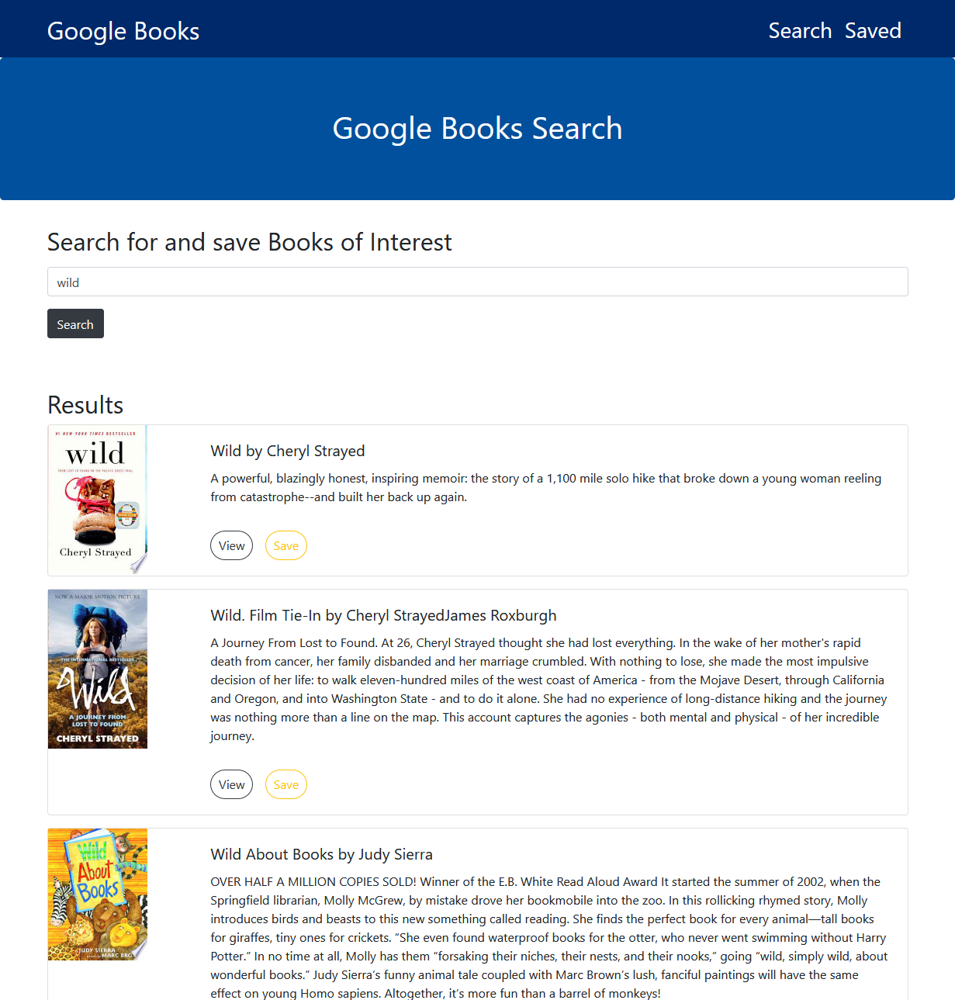

# Google Books Search



A MERN stack React.js application that uses the google books api to find and save books.

## Installation

Use the package manager npm. Install on both root and client side.

```bash
npm i
```

## Usage

```bash
npm run start
```

## Contributing

Pull requests are welcome. For major changes, please open an issue first to discuss what you would like to change.

Please make sure to update tests as appropriate.

## License

[MIT](https://choosealicense.com/licenses/mit/)
